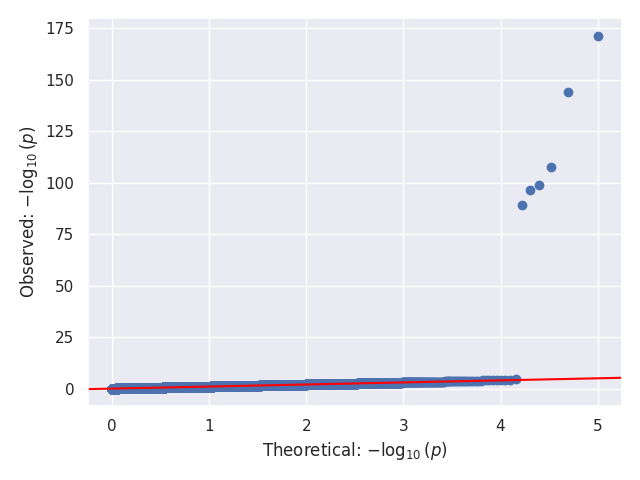
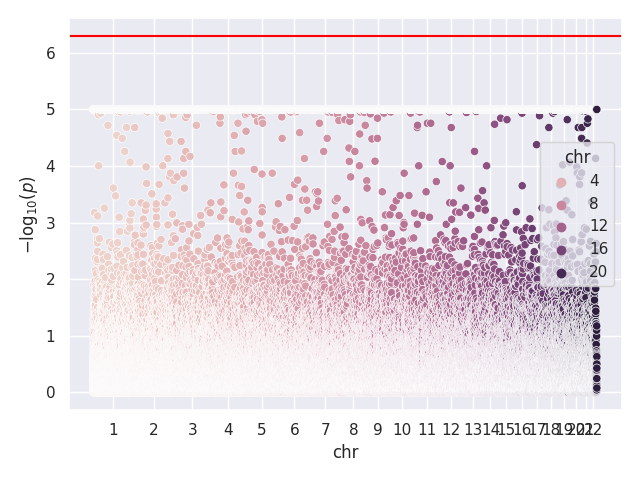
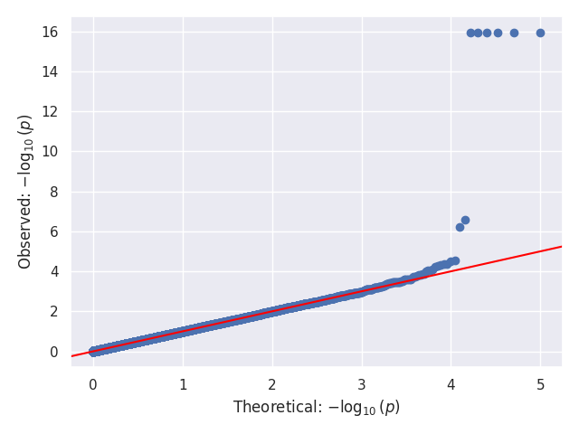
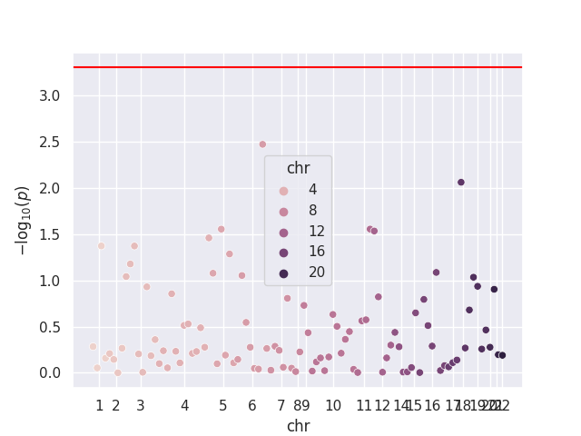
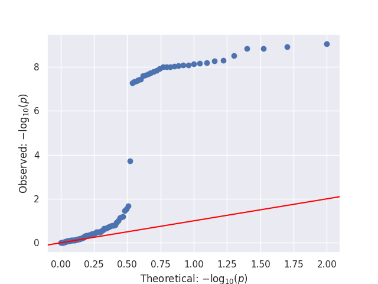
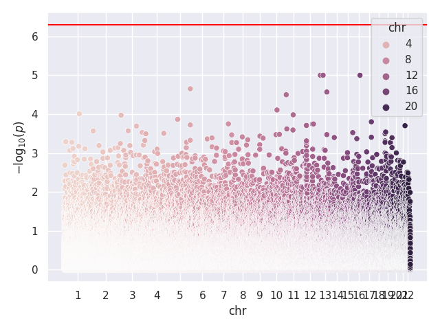

# pyGEMMA - A Python Implementation of Genome-Wide Efficient Mixed-Model Analysis (GEMMA)

## Table of Contents

- [Software Requirements](#software-requirements)
- [Installation](#installation)
- [Usage](#usage)
- [Examples](#examples)
- [Contact](#contact)

## Software Requirements
The current implementation of `pyGEMMA` was tested on the following configuration:

### Operating System and Compilers
- Ubuntu 18.04.6 LST (Bionic Beaver)
- gcc/g++ 7.5.0 (Ubuntu 7.5.0-3ubuntu1~18.04)

### Python Environment
- [Python 3.7.15](https://www.python.org/)
- [Numpy 1.21.6](https://numpy.org/)
- [Cython 0.29.33](https://cython.org/)
- [Pandas 1.3.5](https://pandas.pydata.org/)
- [Scipy 1.5.0](https://scipy.org/)
- [Scikit-learn 0.24.2](https://scikit-learn.org/stable/)
- [Matplotlib 3.3.0](https://matplotlib.org/)
- [Seaborn 0.12.2](https://seaborn.pydata.org/)
- [rich 13.3.2](https://github.com/Textualize/rich)
- [qnorm 0.8.1](https://github.com/Maarten-vd-Sande/qnorm)

## Installation
The installation of `pyGEMMA` is straightforward and can be informed using Python's `pip` package manager. Here, we detail the installation process using a `virtualenv` Python enviroment. This has been tested with the configuration listed in the [Software Requirements](#software-requirements) section. While installation may be possible with other configurations, we it has only been tested with the configuration we list.

1. Create your Python environment and activate it. Using `virtualenv`, this can be done by running
```bash
pip3 install virtualenv
python3 -m virtualenv pygemma_env
source pygemma_env/bin/activate
```

Note: If `pip3 install virtualenv` fails because it can't find `pip3`, you can try running `python3 -m pip install virtualenv` instead. This looks for the `pip` module directly if `pip3` isn't in your `PATH`. 

2. Ensure the `Numpy` and `Cython` packages are both installed prior to installing `pyGEMMA` (they will not be installed automatically). This can be done by running 
```bash
pip install numpy Cython
```

3. Clone this repository.
4. Install `pyGEMMA`'s dependencies. From the `pygemma` directory, this can be done by running
```bash
pip install -r requirements.txt
```
6. Ensure that you have a valid `C/C++` compiler loaded. `pyGEMMA` has been tested using `gcc/g++`.

7. Install `pyGEMMA`. From the `pygemma` directory, this can be done by running 
```bash
python setup.py install
```


## Usage
The `pyGEMMA` package contains both high-level and low-level functions for fitting the linear mixed model outlined in the original GEMMA paper by [Zhou et al. (Nat Gen 2012)](https://www.nature.com/articles/ng.2310).

### General Usage
The `pyGEMMA` package is designed to fit the same model as GEMMA. That is, it fits

$$
\mathbf{y} = \mathbf{W} \mathbf{\alpha} + \mathbf{x} \mathbf{\beta} + \mathbf{Z} \mathbf{u} + \mathbf{\varepsilon}
$$

$$
\mathbf{u} \sim \mathcal{\text{MVN}}_{m}(\mathbf{0}, \lambda \tau^{-1} \mathbf{K})
$$

$$
\mathbf{\varepsilon} \sim \mathcal{\text{MVN}}_{n} \left(\mathbf{0},\tau^{-1} \mathbf{I}_n \right)
$$

where $\mathbf{y}$  is $n \times 1$ is the vector phenotype, $\mathbf{W}$ is $n \times c$ is the matrix of fixed effect covariates (including the intercept), $\mathbf{\alpha}$ is the $c \times 1$ vector of coefficients for the covariates, $\mathbf{x}$ is the $n \times 1$ vector of genotypes, $beta$ is the effect size of the genotype, $\mathbf{Z}$ is the $n \times m$ loading matrix, $\mathbf{u}$ is the $m \times 1$ vector of random effects, $\mathbf{\varepsilon}$ is the $n \times 1$ vector of errors, $\tau^{-1}$ is the variance of the resitual errors, $\lambda$ is the ratio between the two variances components, and $\mathbf{K}$ is the relatedness matrix. (Description adapted from [Zhou et al. (Nat Gen 2012)](https://www.nature.com/articles/ng.2310))

This model can be fit using the function `pygemma.lmm.pygemma`.
```python
from pygemma import lmm
lmm.pygemma(Y, X, W, K, snps=snps, verbose=1)
```

Note that `snps` is a list of SNP names that will be used to label the `pandas DataFrame` returned by the function. `verbose` controls whether to output run progress.

## Examples

### Test Script
We provide a [test script](`https://github.com/rlangefe/pygemma/blob/main/tests/test_pygemma.py`) designed to test almost all basic functions and to run on three GWAS test cases (10,000 SNPs each). Before using the script, the paths for the data should be updated, as they are currently hardcoded (to be changed later). In our tests, this script took around 1 to 1.5 hours to run. Below, we show the Q-Q and Manhattan plots for the three test cases.

<table>
  <tr>
    <td> </td>
    <td></td>
   </tr> 
   <tr>
      <td></td>
      <td>
  </tr>
  <tr>
      <td></td>
      <td>
  </td>
  </tr>
</table>

### 1000 Genomes Data
We provide a number of scripts to run eQTL analyses for over 7100 genes using data from 1000 Genomes. These scripts are provided [here](https://github.com/rlangefe/pygemma/tree/main/experiments/1000G).

The jobs may be launched by batching the [`run_pyGEMMA.sh`](https://github.com/rlangefe/pygemma/blob/main/experiments/1000G/run_pyGEMMA.sh) script. Note that all files in the directory should be examined and paths modified before running. The scripts were designed to run using the [SLURM](https://slurm.schedmd.com/) scheduler.

## Contact
[@rlangefe](https://github.com/rlangefe) - Robert Langefeld (Department of Biostatistics - University of Michigan)

If you have any questions or comments, please feel free to contact me.
