# pyGEMMA: A Fast, User-Friendly Python/R Implementation of Linear Mixed Models for Genome-Wide Association Studies

## Table of Contents

- [Software Requirements](#software-requirements)
- [Installation](#installation)
- [Usage](#usage)
- [Examples](#examples)
- [Contact](#contact)

## Software Requirements
The current implementation of `pyGEMMA` was tested on the following configuration:

### Operating System and Compilers
- Ubuntu 18.04.6 LST (Bionic Beaver)
- gcc/g++ 7.5.0 (Ubuntu 7.5.0-3ubuntu1~18.04)

### Python Environment
- [Python 3.8.10](https://www.python.org/)
- [Numpy 1.24.4](https://numpy.org/)
- [Cython 3.0.2](https://cython.org/)
- [Pandas 2.0.3](https://pandas.pydata.org/)
- [Scipy 1.10.1](https://scipy.org/)
- [Scikit-learn 0.24.2](https://scikit-learn.org/stable/)
- [Matplotlib 3.7.1](https://matplotlib.org/)
- [Plotly 5.19.0](https://plotly.com/)
- [Seaborn 0.12.2](https://seaborn.pydata.org/)
- [rich 13.5.2](https://github.com/Textualize/rich)
- [qnorm 0.8.1](https://github.com/Maarten-vd-Sande/qnorm)

## Installation
The installation of `pyGEMMA` is straightforward and can be performed using Python's `pip` package manager. Here, we detail the installation process using a `virtualenv` Python enviroment. This has been tested with the configuration listed in the [Software Requirements](#software-requirements) section. While installation may be possible with other configurations, we it has only been tested with the configuration we list.

1. Create your Python environment and activate it. Using `virtualenv`, this can be done by running
```bash
pip3 install virtualenv
python3 -m virtualenv pygemma_env
source pygemma_env/bin/activate
```

Note: If `pip3 install virtualenv` fails because it can't find `pip3`, you can try running `python3 -m pip install virtualenv` instead. This looks for the `pip` module directly if `pip3` isn't in your `PATH`. 

2. Ensure the `Numpy` and `Cython` packages are both installed prior to installing `pyGEMMA` (they will not be installed automatically). This can be done by running 
```bash
pip install numpy Cython
```

3. Clone this repository.
4. Install `pyGEMMA`'s dependencies. From the `pygemma` directory, this can be done by running
```bash
pip install -r requirements.txt
```
6. Ensure that you have a valid `C/C++` compiler loaded. `pyGEMMA` has been tested using `gcc/g++`.

7. Install `pyGEMMA`. From the `pygemma` directory, this can be done by running 
```bash
python setup.py install
```


## Usage
The `pyGEMMA` package contains both high-level and low-level functions for fitting the linear mixed model outlined in the original GEMMA paper by [Zhou et al. (Nat Gen 2012)](https://www.nature.com/articles/ng.2310).

### General Usage
The `pyGEMMA` package is designed to fit the same model as GEMMA. That is, it fits

$$
\mathbf{y} = \mathbf{W} \mathbf{\alpha} + \mathbf{x} \mathbf{\beta} + \mathbf{Z} \mathbf{u} + \mathbf{\varepsilon}
$$

$$
\mathbf{u} \sim \mathcal{\text{MVN}}_{m}(\mathbf{0}, \lambda \tau^{-1} \mathbf{K})
$$

$$
\mathbf{\varepsilon} \sim \mathcal{\text{MVN}}_{n} \left(\mathbf{0},\tau^{-1} \mathbf{I}_n \right)
$$

where $\mathbf{y}$  is $n \times 1$ is the vector phenotype, $\mathbf{W}$ is $n \times c$ is the matrix of fixed effect covariates (including the intercept), $\mathbf{\alpha}$ is the $c \times 1$ vector of coefficients for the covariates, $\mathbf{x}$ is the $n \times 1$ vector of genotypes, $beta$ is the effect size of the genotype, $\mathbf{Z}$ is the $n \times m$ loading matrix, $\mathbf{u}$ is the $m \times 1$ vector of random effects, $\mathbf{\varepsilon}$ is the $n \times 1$ vector of errors, $\tau^{-1}$ is the variance of the resitual errors, $\lambda$ is the ratio between the two variances components, and $\mathbf{K}$ is the relatedness matrix. (Description adapted from [Zhou et al. (Nat Gen 2012)](https://www.nature.com/articles/ng.2310))

This model can be fit using the function `pygemma.lmm.pygemma`.
```python
from pygemma import lmm
lmm.pygemma(Y, X, W, K, snps=snps, verbose=1)
```

Note that `snps` is a list of SNP names that will be used to label the `pandas DataFrame` returned by the function. `verbose` controls whether to output run progress.

#### pyGEMMA in R
We have also developed an R interface for pyGEMMA, enabling its use within the R programming environment. A comprehensive tutorial for this integration can be found [here](https://htmlpreview.github.io/?https://github.com/rlangefe/pygemma/blob/main/pyGEMMA.html)

## Examples

### UK Biobank Benchmark
We provide our benchmarks for the UK Biobank data in the [experiments/benchmarks](https://github.com/rlangefe/pygemma/tree/main/experiments/benchmarks) directory. This benchmarking consisted of running random subsets of 50,000 individuals of European ancestry from the UK Biobank data. Subsets were taken from 50 to 10,000 samples and 20 to 100,000 SNPs.

We use this data to compare the runtime of `pyGEMMA` to competing methods, namely `GEMMA`, `GCAT`, and `fastGWA`. `Regenie` is not represented here due to the long runtime of its Stage I phase.

Speedup is calculated as $\frac{t_{\text{Method}}}{t_{\text{pyGEMMA}}}$.

<table>
  <tr>
    <td>Runtime</td>
    <td>Speedup</td>
  </tr>
  <tr>
    <td> 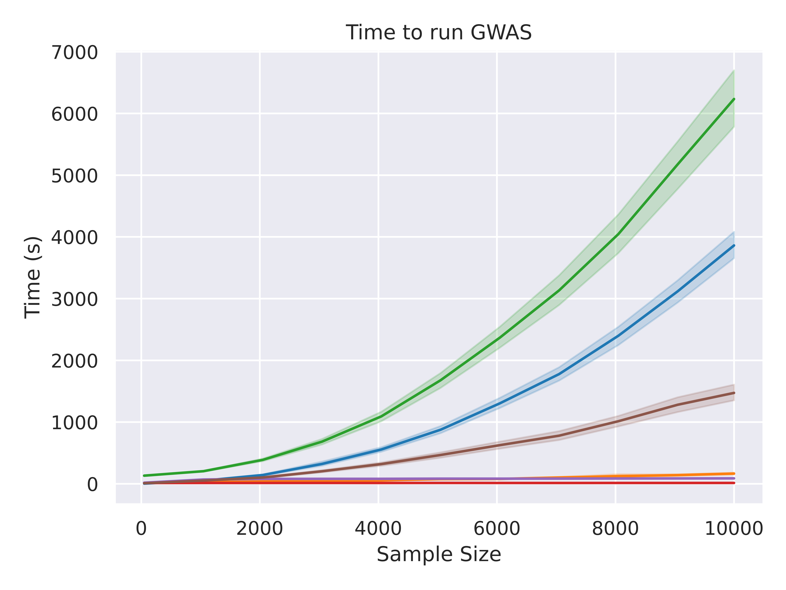</td>
    <td>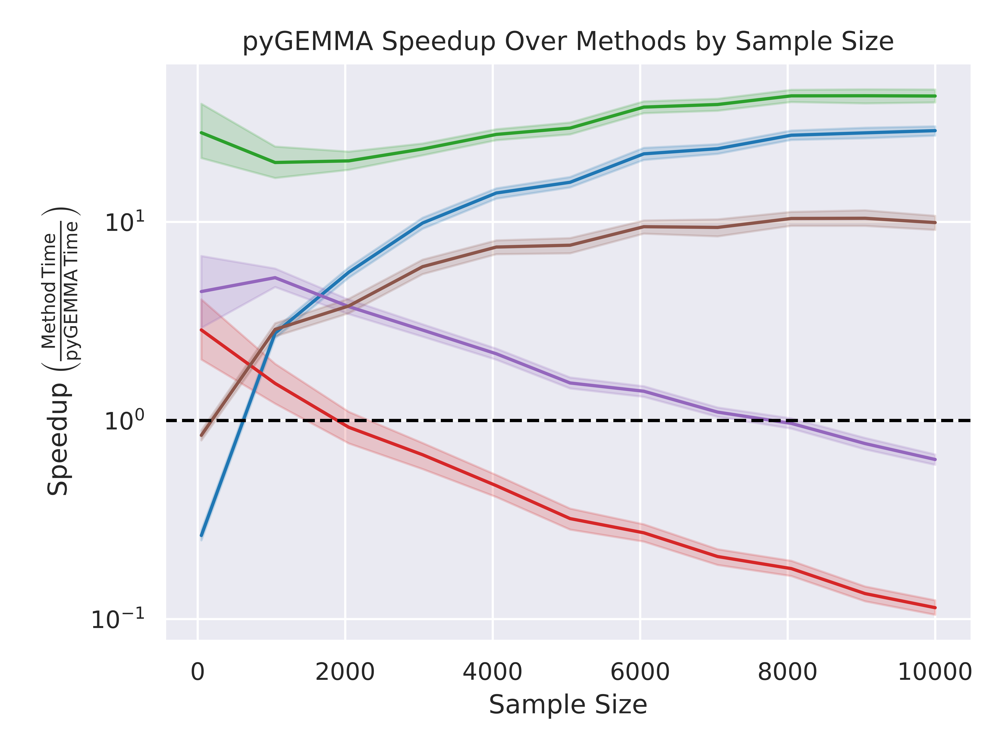</td>
   </tr> 
   <tr>
      <td>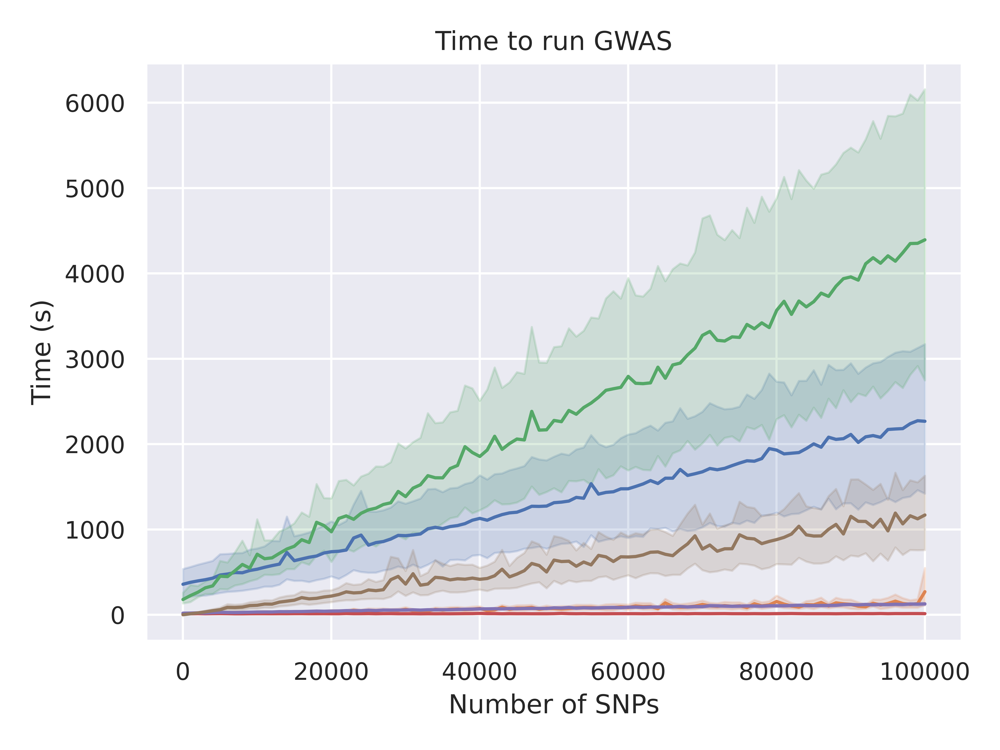</td>
      <td>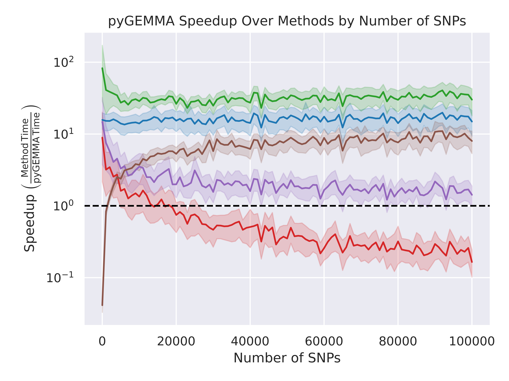
  </td>
  </tr>
</table>

Methods:
`pyGEMMA`(<code style="color:#ff7f0e">■</code>), `pyGEMMA - Grid Search`(<code style="#9467bd">■</code>), `GEMMA`(<code style="color:#1f77b4">■</code>), `GCTA`(<code style="color:#2ca02c">■</code>), `fastGWA`(<code style="color:#d62728">■</code>), `Linear Regression`(<code style="color:#8c564b">■</code>)

Based on this, we see that `pyGEMMA` is at $\approx$ 15-20 times faster than `GCTA` and over 10 times faster than `GEMMA`. While `fastGWA` is faster than `pyGEMMA` for small datasets, `pyGEMMA` is faster for larger datasets.

### GEMMA Mouse Data
This dataset consisted of 12,226 SNPs, 1940 mice, and 4 phenotypes. The data was taken from  [GEMMA](https://github.com/genetics-statistics/GEMMA)'s test dataset. The data can be found here: [GEMMA Mouse Data](https://github.com/genetics-statistics/GEMMA/tree/master/example)

We use this dataset to benchmark scaling with the number of covariates in the model. We compared `pyGEMMA` against `GEMMA` and `GCTA`.

<table>
  <tr>
    <td>Runtime</td>
    <td>Speedup</td>
  </tr>
  <tr>
    <td> 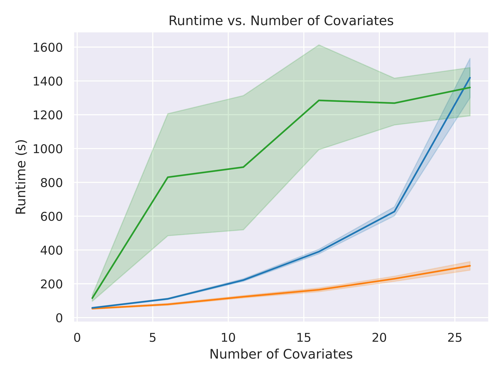</td>
    <td>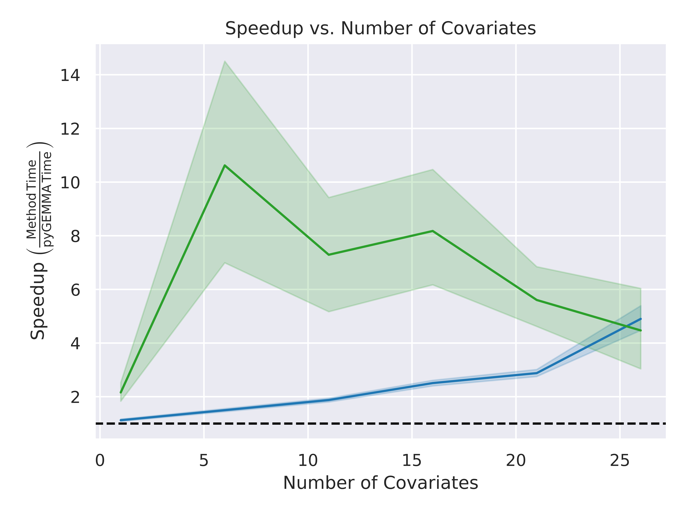</td>
   </tr> 
</table>

Methods:
`pyGEMMA`(<code style="color:#ff7f0e">■</code>), `GEMMA`(<code style="color:#1f77b4">■</code>), `GCTA`(<code style="color:#2ca02c">■</code>)

Based on this, we see that `pyGEMMA` is significantly faster than both `GEMMA` and `GCTA`. It also exhibits better scaling behavior as the number of covariates increases.

### Wellcome Trust Case Control Consortium (WTCCC) Data
This dataset consists of $\approx$ 390,000 SNPs and 6 binary phenotypes, with around 2,000 case and 3,000 control samples. The data was taken from the [WTCCC](https://www.wtccc.org.uk/) study.

We use this dataset to demonstrate that `pyGEMMA` and `GEMMA` produce identical results.

<table>
  <tr>
    <td>Beta</td>
    <td>-log10 of p-values</td>
  </tr>
  <tr>
    <td> 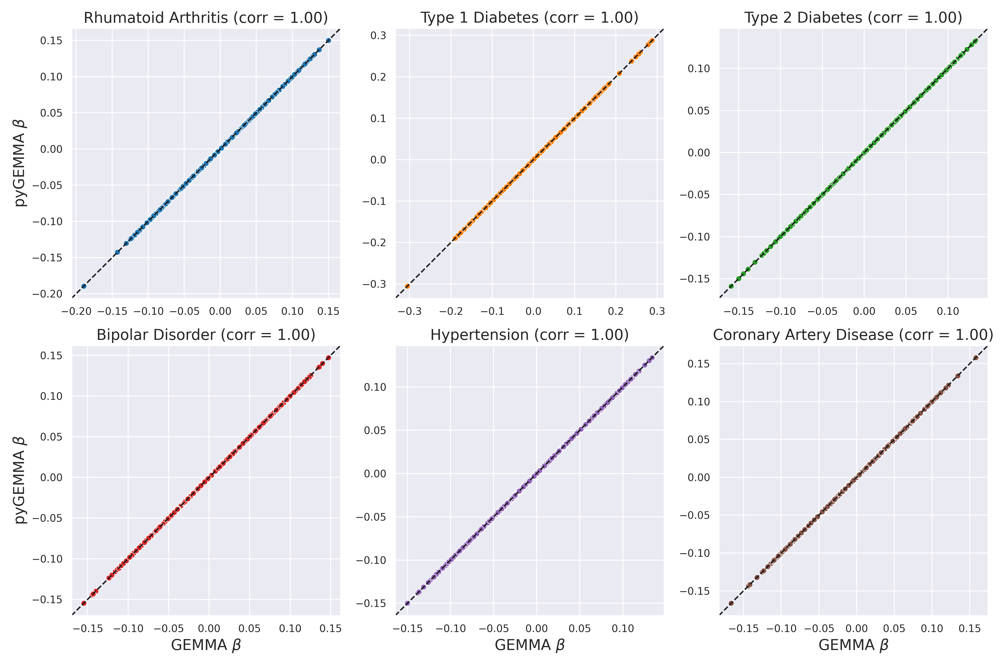</td>
    <td>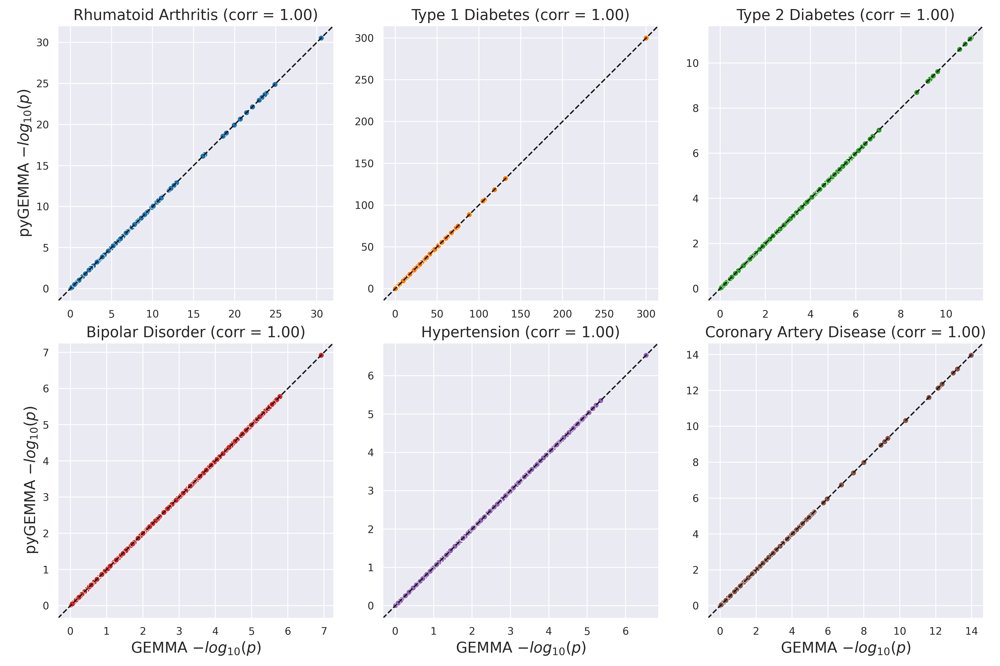</td>
   </tr> 
</table>

These plots show that the effect sizes and p-values produced by `pyGEMMA` and `GEMMA` are identical.


<!-- ### Test Script
We provide a [test script](`https://github.com/rlangefe/pygemma/blob/main/tests/test_pygemma.py`) designed to test almost all basic functions and to run on three GWAS test cases (10,000 SNPs each). Before using the script, the paths for the data should be updated, as they are currently hardcoded (to be changed later). In our tests, this script took around 7.5 to 8 hours to run. Below, we show the Q-Q and Manhattan plots for the three test cases.

<table>
  <tr>
    <td> </td>
    <td>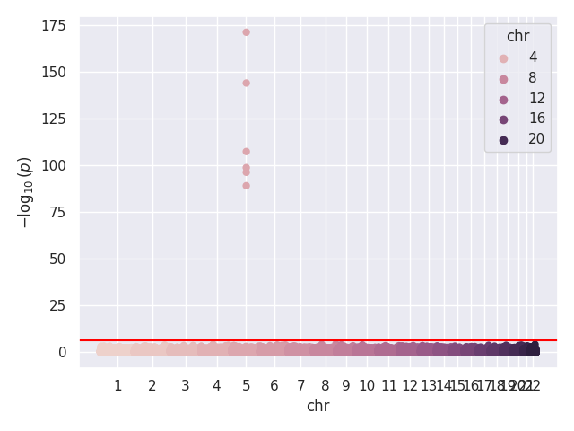</td>
   </tr> 
   <tr>
      <td>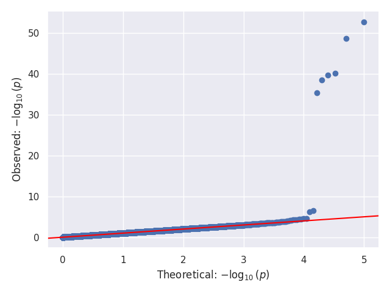</td>
      <td>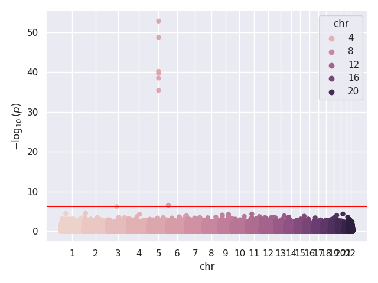
  </tr>
  <tr>
      <td>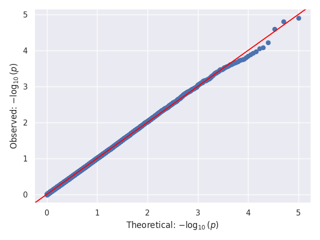</td>
      <td>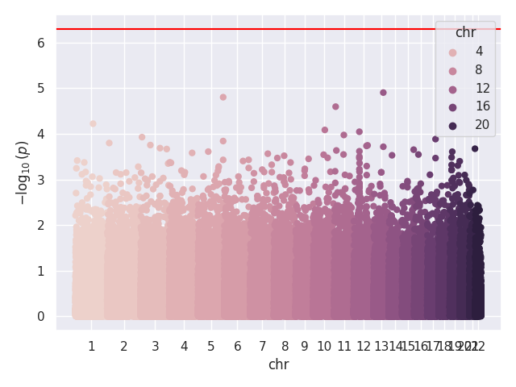
  </td>
  </tr>
</table>

### 1000 Genomes Data
We provide a number of scripts to run eQTL analyses for over 7100 genes using data from 1000 Genomes. These scripts are provided [here](https://github.com/rlangefe/pygemma/tree/main/experiments/1000G).

The jobs may be launched by batching the [`run_pyGEMMA.sh`](https://github.com/rlangefe/pygemma/blob/main/experiments/1000G/run_pyGEMMA.sh) script. Note that all files in the directory should be examined and paths modified before running. The scripts were designed to run using the [SLURM](https://slurm.schedmd.com/) scheduler. -->

## Contact
[@rlangefe](https://github.com/rlangefe) - Robert Langefeld (Department of Biostatistics - University of Michigan)

If you have any questions or comments, please feel free to contact me.
